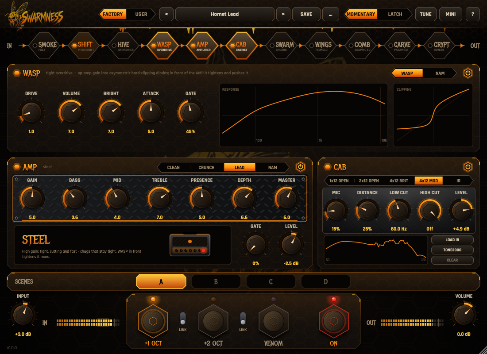
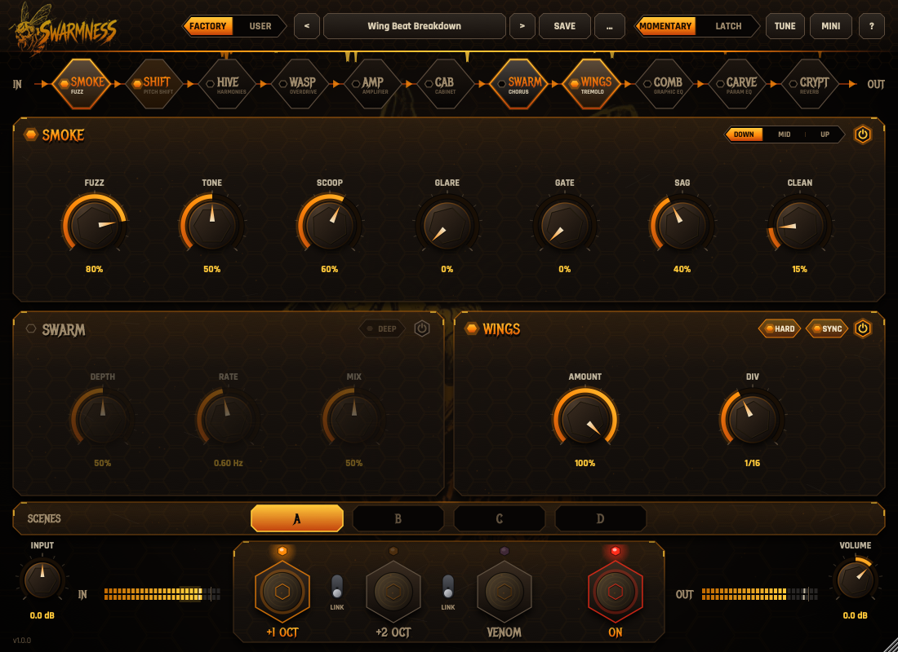
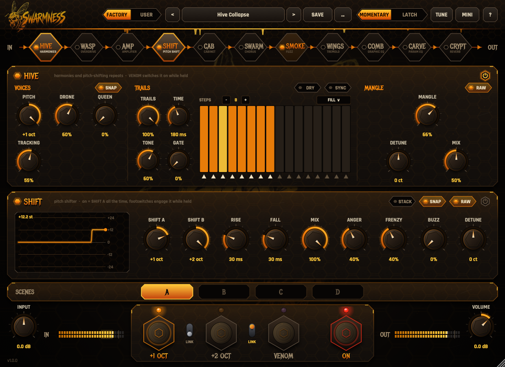
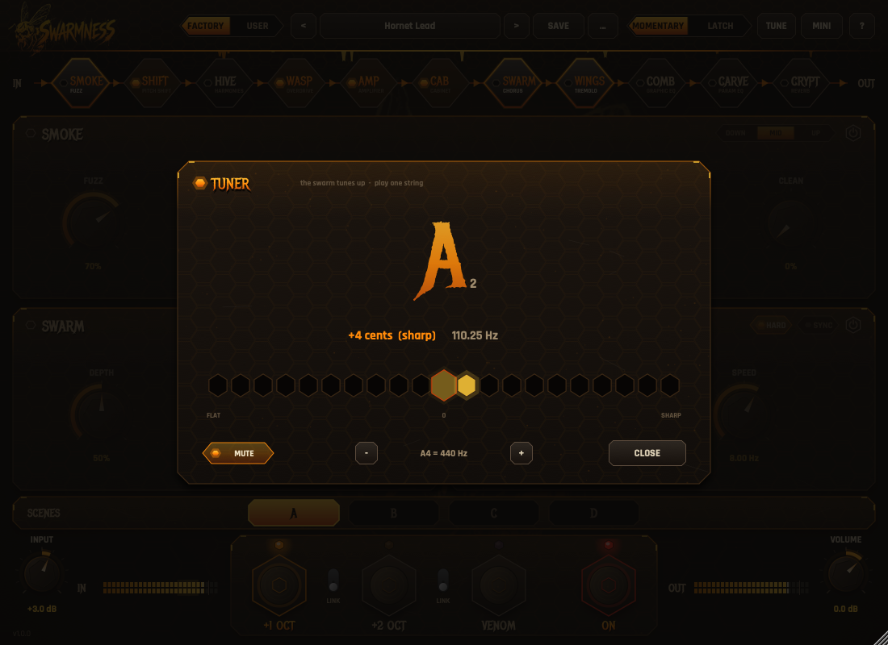

# Swarmness 1.0

**Рой разъярённых пчёл в виде плагина: октавы, диссонанс, гармонии с «ядом» регенерации, фузз, овердрайв, модели усилителей (и NAM-захваты), кабинеты и IR, хорус, тремоло-гейт, тюнер, два эквалайзера и реверб в переставляемой цепи — для дэткора, металкора и хардкора.**
VST3 / AU / Standalone · Windows, macOS (Universal: Apple Silicon + Intel), Linux.


**[Скачать последнюю версию →](https://github.com/danilivnsmir-hub/swarmness-vst3/releases/latest)**



<details>
<summary>Другие страницы: FX, PITCH, тюнер</summary>





</details>

---

## Цепочка сигнала

```
вход → INPUT → [ SMOKE ][ SHIFT ][ HIVE ][ WASP ][ AMP ][ CAB ][ SWARM ][ WINGS ][ COMB ][ CARVE ][ CRYPT ] → VOLUME → выход

любые блоки можно поставить параллельно:
вход ─┬─ A: [ SMOKE ] ─┬─ MIX → [ SHIFT ][ HIVE ] ─┬─ A: [ SWARM ] ─┬─ MIX → [ WINGS ] … → выход
      └─ B: (чистый) ──┘                          └─ B: [ CRYPT ] ─┘
```

Цепь **переставляется**: полоса с шестигранными плитками под шапкой — это и есть цепочка слева направо.
- **перетащите** плитку, чтобы переставить блок (фузз до или после питча, реверб перед фуззом, EQ перед фуззом как бустер…);
- **клик** по плитке открывает страницу блока: **PITCH** (SHIFT и HIVE), **FX** (SMOKE сверху, под ним SWARM и WINGS), **RIG** (WASP, под ним AMP и CAB), **EQ** (COMB и CARVE) или **CRYPT**;
- **клик по индикатору** на плитке включает/выключает блок (индикатор SHIFT горит и пока нажат футсвич SHIFT A / B, индикатор HIVE — и от VENOM);
- **правый клик** по плитке — MIDI Learn для её включения (см. «MIDI»);
- **параллельно:** потяните плитку **вверх** — она уйдёт в параллельную ветку **A**, **вниз** — в ветку **B**, обратно в середину — снова последовательно. Подряд идущие параллельные блоки образуют одну развилку; последовательный блок между ними начинает новую — развилок может быть несколько (до 4), у каждой своя ручка баланса. Пустая ветка = чистый сигнал (**DRY**): например, SMOKE в ветке A и пустая B — классический параллельный фузз с подмесом чистого. Мини-ручка в точке слияния каждой развилки — баланс **A/B** (в центре обе ветки по половине: одинаковые ветки дают ровно исходный уровень). Ветки выровнены по задержке, так что фузз в одной ветке не фазит с другой.

Порядок и ветки сохраняются в пресетах и в сессии; при перестановке звук на ~8 мс приглушается, щелчков нет. По умолчанию: SMOKE → SHIFT → HIVE → WASP → AMP → CAB → SWARM → WINGS → COMB → CARVE → CRYPT (как на педалборде: педали перед усилителем, модуляция и реверб после кабинета). В старых сессиях и пресетах AMP и CAB встают сразу после HIVE, а WASP — прямо перед AMP. Старые сессии и пресеты с SMOKE **POST** открываются с SMOKE после SWARM.

Задержка всего 61 сэмпл при 44,1/48 кГц (≈1,3 мс; меньше на 96/192 кГц): её вносит только оверсэмплинг фузза, она не зависит от порядка блоков и сообщается DAW. Моно-гитару можно ставить на стерео-трек: плагин разведёт SWARM и HIVE в стерео. Когда ничего не включено, плагин прозрачен бит в бит.

## Футсвичи

| Кнопка | Что делает |
|---|---|
| **SHIFT A** | Сдвиг на интервал SHIFT A (по умолчанию +1 октава) — подпись на кнопке показывает интервал |
| **SHIFT B** | Сдвиг на интервал SHIFT B (по умолчанию +2 октавы): если нажаты обе, B важнее A — а со **STACK** звучат оба интервала сразу |
| **VENOM** | Включает HIVE, пока нажат, и раскачивает его TRAILS до самовозбуждения |
| **ON** | Включение / байпас плагина |

Футсвичи работают как настоящие моментальные педали: **SHIFT A**, **SHIFT B** и **VENOM** включают свой эффект сразу, даже если плагин выключен кнопкой **ON** или выключен сам блок. Правило одно для всех: кнопка питания блока включает его постоянно, футсвич — пока нажат.

Мини-тумблеры **LINK** рядом с SHIFT A / B: если тумблер поднят, нажатие **VENOM** включает и этот сдвиг. Так одним футсвичем включаются и сдвиг, и VENOM.

Переключатель **MOMENTARY / LATCH** в шапке: в режиме **MOMENTARY** эффект звучит, пока кнопка зажата; в режиме **LATCH** нажал — включилось, нажал ещё раз — выключилось.

## Сцены и режим MINI

**SCENES A / B / C / D** (полоса над футсвичами) — четыре версии звука внутри одного пресета, как сцены у напольных процессоров. Клик — переключиться (все ручки переезжают плавно, без щелчков). Новая сцена начинается как копия той, из которой пришли; всё, что крутите, остаётся в текущей сцене. Порядок блоков и ветки в цепи общие для всех сцен, всё остальное (включение блоков, ручки, шаги TRAILS, EQ, реверб) у каждой сцены своё. Сцены сохраняются в пользовательском пресете (пресет загружается на сцене A) и в проекте DAW. Правый клик по сцене — **MIDI Learn** (педаль сразу выбирает эту сцену) и «скопировать текущую сцену сюда». Сцену можно автоматизировать в DAW (параметр **Scene**).

Кнопка **MINI** в шапке — маленькое окно для игры вживую: пресет, цепь, сцены, футсвичи и уровни. **FULL** или клик по плитке в цепи возвращает полный вид.

## Тюнер

Кнопка **TUNE** в шапке открывает тюнер: крупная нота с октавой, соты от −50 до +50 центов (горит ячейка, где сейчас струна, центр светится мёдом, когда строй точный), отклонение в центах и частота. Ловит от ~25 Гц — низкие строи 7- и 8-струнных гитар и дропы тоже (точность лучше 0,1 цента). **MUTE** глушит выход, пока тюнер открыт; эталон **A4** — 430…450 Гц. Закрывается кнопкой **CLOSE** или кликом мимо окна. Пока тюнер закрыт, он не тратит процессор.

## MIDI

**Правый клик по любому контролу** — ручке, переключателю, кнопке питания, селектору, футсвичу или плитке в цепи → **MIDI Learn**, затем нажмите педаль / клавишу или покрутите CC на контроллере. Как работает привязка:
- **выключатели** (ON, питание блоков, SYNC, RAW, STACK…) переключаются на каждое нажатие (CC ≥ 64 или нота); отпускание ничего не меняет — подходит для обычной кнопки контроллера (127 при нажатии, 0 при отпускании);
- **футсвичи SHIFT A / B и VENOM** следуют MOMENTARY / LATCH: в MOMENTARY звучат, пока педаль нажата;
- **селекторы** (VOICE, тип реверба…) на каждое нажатие переходят к следующему варианту;
- **ручки** следуют значению CC (0…127 → весь диапазон).

Одну педаль можно привязать к любому числу контролов (например, ON и WINGS одной кнопкой), у контрола может быть несколько привязок. **Clear MIDI** в том же меню снимает привязки. Всё сохраняется в проекте; привязки футсвичей из прошлых версий переносятся.

**Как MIDI попадает в плагин.** Плагин слушает MIDI своей дорожки. В Reaper у дорожки с гитарой вход аудио, поэтому MIDI с контроллера туда само не приходит. Варианты: (1) создать отдельную дорожку с входом MIDI от контроллера (запись включена, мониторинг включён) и сделать с неё MIDI-посыл (send) на гитарную дорожку; (2) пользоваться Learn самого Reaper (он управляет параметрами плагина напрямую). В Standalone-версии контроллер включается в Options → Audio/MIDI Settings → MIDI Inputs. Педали работают и когда плагин выключен кнопкой ON.

## Секции

Страница **PITCH** — два блока, каждый со своим местом в цепи:

**SHIFT (жало)** — сдвиг высоты как педаль-питч-шифтер с педалью экспрессии. Кнопка питания включает его постоянно (звучит SHIFT A, как «залоченная» педаль); футсвичи SHIFT A / B включают его, пока нажаты, даже если он выключен.
- **SHIFT A / SHIFT B** — интервалы двух футсвичей, −24…+24 полутона (октавы, квинты, кварты, любой шаг; вниз — вместо старого DIVE);
- **RISE** / **FALL** — время «въезда» в интервал и возврата после отпускания;
- **MIX** — 100% — только сдвинутая нота (как на педали), 50% — сдвиг и сухой оба в полную громкость (даблинг);
- **STACK** — нажаты A и B вместе: звучат оба интервала (от голоса A отделяется второй голос и уезжает к B; отпустили B — он сливается обратно). Без STACK B важнее A;
- **ANGER** — второй, расстроенный голос: биения, диссонанс; **FRENZY** — случайные скачки высоты, со **SNAP** — по квартам, квинтам и октавам; **BUZZ** — all-pass фейзер + амплитудная модуляция; **DETUNE** — ±50 центов (целыми центами); **RAW** — характер дешёвых педальных DSP.

**HIVE (улей)** — гармонии и повторы со сдвигом. Строит голоса от того, что приходит на его вход: после SHIFT (по умолчанию) голоса идут за сдвинутой нотой, если поставить SHIFT и HIVE параллельно — строятся от сыгранной ноты, а если HIVE перед SHIFT — футсвич сдвигает вместе с нотой и голоса, и хвосты. Кнопка питания включает голоса и повторы; **VENOM** включает HIVE, пока нажат.

*VOICES* — гармонии:
- **PITCH** — интервал DRONE −12…+12 (с **SNAP** по полутонам, без — атональные промежуточные);
- **DRONE** — основной голос, **QUEEN** — октава от него;
- **TRACKING** — вверху плотные гармонии, внизу лаг, длинные повторяющиеся гранулы и «кластеры».

*TRAILS* — повторы DRONE в петле со сдвигом:
- **TRAILS** — сколько длятся повторы (затухают сами), **TIME** — расстояние между повторами = длина шага (с **SYNC** — доля такта DAW), **TONE** — яркость, **GATE** — рубит каждый шаг (0% — повторы целиком, больше — короче и рубленее, «чопы»), **DRY** — повторы строятся от сыгранной ноты, а не от DRONE: HIVE превращается в дилей (шаги HOLD — обычное эхо, UP / DOWN — питч-дилей; пресеты Pitch Delay и Dotted Echo);
- **STEPS** — сетка повторов, как у pattern tremolo, только шаги — это повторы: столбик 1 = первый повтор после ноты, 2 = второй и т.д. (сетка перезапускается с каждой сыгранной нотой; с SYNC при игре DAW идёт по сетке такта):
  - высота столбика — громкость повтора (0 = тихий повтор, хвост при этом продолжает жить), рисуется мышью по нескольким шагам, двойной клик — вкл/выкл;
  - значок под столбиком — что повтор делает с высотой: **=** держит, **▲ / ▼** — на PITCH вверх / вниз, **?** — случайная ступень аккорда или октава, **◀** — задом наперёд (клик — следующий, правый клик — меню);
  - **STEPS − / +** — длина паттерна (1…16), **FILL** — готовые: Ladder, Bounce, Scatter, Reverse, Swell, Echo, Stutter, Gallop, Offbeat, Glitch.
- Футсвич **VENOM** раскачивает петлю до самовозбуждения.

*MANGLE* — действует на голоса и повторы HIVE:
- **MANGLE** — одна ручка хаоса: сначала «кислые» расстроенные голоса (биения, диссонанс), дальше добавляются случайные скачки высоты (со SNAP — по квартам, квинтам, октавам), к максимуму — жужжание и металлический визг all-pass + AM. Три отдельные ручки ANGER / FRENZY / BUZZ остались у SHIFT;
- **DETUNE** — ±50 центов (целыми центами): ширина голосов (DRONE вверх, QUEEN вниз);
- **MIX** — сухой / голоса: на 50% оба в полную громкость, на 100% — только голоса и повторы;
- **RAW** (по умолчанию включён) — характер дешёвых педальных DSP для всех голосов: эмуляция преобразователей и медленное «плавание» высоты (глубже на низком TRACKING). Без RAW — чистый движок; октавы вверх слегка темнеют (без «бурундука»). Склейки всегда выровнены по форме волны, атака сдвига восстанавливается по сухому сигналу.

Самовозбуждение — только на футсвиче **VENOM**: повторы разрастаются и держатся, но мягко, без визга. Голоса звучат живее: у каждого свой медленный дрейф на несколько центов, DRONE чуть левее, QUEEN чуть правее.

**SWARM (рой)** — стерео-хорус с окраской как у аналоговых BBD-педалей (тёмный, слегка перегруженный): **DEPTH** — от лёгкого расширения до морской болезни, **RATE**, **MIX** (на 50% сухой и хорус звучат оба в полную громкость, на 100% — чистое вибрато). **DEEP** — 8 голосов с сильной обратной связью.

**SMOKE (дым)** — «джамбо»-фузз на высоком гейне: три каскада клиппинга, 4× оверсэмплинг.
- **VOICE** — **DOWN** (дум: низкая середина и полный низ), **MID** (классический «jumbo fuzz»), **UP** (подтянутый низ и визжащая верхняя середина);
- **FUZZ** — от грязного кранча до стены фузза;
- **TONE** — темнее / ярче;
- **SCOOP** — глубина выреза середины;
- **GLARE** — гейтированная октава вверх, прорывается при сильной атаке;
- **GATE** — «дохлая батарейка»: фузз захлёбывается и рвётся на затухании;
- **SAG** — «дыхание»: на атаке питание проседает (звук поджимается и темнеет), а затем нота расцветает обратно; чем больше SAG, тем глубже и дольше. Даже на нуле схема живая: разделительный конденсатор меняет асимметрию по ходу ноты, тон ярче на атаке и темнее на затухании, детали медленно «плавают» по-своему в каждом канале;
- **CLEAN** — подмес чистого сигнала под фузз, фузз остаётся на полной громкости (атака и низ).

Отклик на игру даёт сама схема, а не автоматическая громкость: обе ступени перегруза работают как диодные ограничители, выход которых растёт по логарифму от входа, а не упирается в потолок. На малом FUZZ мягкая игра и убавленная громкость гитары заметно очищают звук. На большом FUZZ фузз плотный, как классический джамбо-фузз на максимальном сустейне: тише играешь — звук чуть тише и круглее, сильнее бьёшь — острее и злее. Вход нагружает звукосниматель, как вход настоящей педали: резонансный пик звукоснимателя приглушён, верх спадает раньше, чем при записи в DI.

Место фузза в цепи задаётся перетаскиванием: перед PITCH трекинг получается грязнее и глитчевее, после — октавы и гармонии идут в фузз.

У SMOKE есть встроенный нойзгейт на входе, он работает всегда. Без него ~50 дБ усиления превращали бы шум звуковой карты и фон звукоснимателей в гул между нотами. Гейт мгновенно открывается на атаке и плавно закрывается, когда вы не играете; сустейн нот не обрубается. Гейт рассчитан на правильно выставленный **INPUT** (пики в зелёной зоне индикатора IN).

**WINGS (крылья)** — ритмический гейт: **AMOUNT** — глубина, **SPEED** — скорость (с **SYNC** вместо неё **DIV** — доля такта), **HARD** — жёсткий статтер (выключено — тремоло), **SYNC** — по темпу DAW (1/1…1/32, триоли, пунктир).

**WASP (овердрайв)** — плотный овердрайв/бустер перед усилителем, в духе современных металл-драйвов для подтяжки хай-гейна. Внутри — схема, решённая как цепь: неинвертирующий каскад на ОУ (плечо усиления поднимает верхнюю середину и выше, мягкие диоды в обратной связи скругляют первую перегрузку), за ним **жёсткий клиппер** — диоды на землю через маленький последовательный резистор, на одной стороне диодов больше, поэтому отрицательная полуволна срезается первой: квадратный несимметричный клиппинг (чётные гармоники) настоящей педали, а не мягкое сжатие классических овердрайвов. Значения схемы подогнаны под три захвата настоящей педали (формы волны на четырёх уровнях, гармоники H2/H3/H5 и компрессия на 40 дБ входа, АЧХ). **DRIVE** — от плотного буста до жёсткого «квадратного» овердрайва, **ATTACK** — насколько подтянуты низы перед клиппингом (вверх — плотные чаги на хай-гейн усилителе, вниз — полнодиапазонный буст), **BRIGHT** — окраска верха, **VOLUME** (5 ≈ та же громкость на средней DRIVE; выкрутите, чтобы сильнее толкнуть усилитель), **GATE** — нойзгейт, который слушает гитару. На панели видны АЧХ педали и кривая клиппинга. По умолчанию стоит прямо перед AMP, на странице RIG вместе с AMP и CAB. Переключатель **WASP | NAM** в заголовке ставит вместо схемы захват педали (`.nam`: любой овердрайв, бустер или фузз): **LOAD .NAM**, перетаскивание файла на панель или **TONE3000** (каталог педалей). У захвата свои **INPUT** и **OUTPUT** (5 = педаль как её сняли, ±18 дБ), **GATE** работает так же; для A2 есть **LITE**. Путь к захвату хранится в сессии и в пресете.

**AMP (усилитель)** — усилитель, смоделированный на уровне схемы, или NAM-захват. Три канала, в каждом свой усилитель:

| Канал | Усилитель |
|---|---|
| CLEAN | **CHROME** — кристально чистый транзисторный канал: запас по перегрузке до 0 dBFS на полудне (никакой компрессии — динамика самой гитары), подтянутый низ, лёгкий вырез середины и «стеклянный» верх; у транзисторного оконечника нет горба резонанса динамика. Для чистых интро и арпеджио, почти как пьезо; с SWARM и CRYPT за ним |
| CRUNCH | **BRIT** — лающий кранч: горячий V1a, «холодный» V1b, катодный повторитель, EL34. Лающая верхняя середина, очищается ручкой громкости гитары |
| LEAD | **STEEL** — плотный хай-гейн: подрезанный низ первых каскадов, «холодный» клиппер, 6L6. Плотные чаги; WASP перед ним подтягивает ещё сильнее |

Как это устроено (почему усилитель отзывчивый):
- каждый каскад — лампа **12AX7** по уравнениям Корена на своей нагрузочной прямой (анодное напряжение, анодный и катодный резисторы, шунтирование катода; «холодные» каскады без шунта);
- **сеточный ток:** когда сетка уходит выше катода, она начинает проводить, пик срезается сопротивлением источника, а разделительный конденсатор заряжается. Каскад после сильного удара на время запирается и восстанавливается за десятки миллисекунд — отсюда «дыхание», компрессия и «плевки» раскочегаренного лампового усилителя. Всё это следует за медиатором: ручкой громкости на гитаре усилитель очищается (BRIT: 3-я гармоника −20 дБ на полной громкости → −45 дБ на −24 дБ);
- **тонстек** — пассивная FMV-схема (BASS / MID / TREBLE), рассчитанная по её реальной схеме со своими номиналами у каждого эталона;
- **оконечник:** фазоинвертор с длинным хвостом, двухтактная пара пентодов в классе AB (закон Чайлда, насыщение, свой сеточный ток), **просадка питания**, **импеданс динамика** как нагрузка (горб резонанса и подъём верха) и **глобальная ООС**, посчитанная без задержки в петле. **PRESENCE** и **DEPTH** убирают обратную связь сверху и снизу, ровно как цепь ООС настоящего усилителя; **MASTER** — насколько сильно раскачан оконечник;
- считается с 8-кратной передискретизацией (антиалиасинг), в моно, как настоящий усилитель: стереоэффекты ставьте после AMP.

Ручки: **GAIN** (логарифмический потенциометр, как в усилителе), **BASS / MID / TREBLE**, **PRESENCE**, **DEPTH**, **MASTER**, **GATE** (нойзгейт, слушает гитару и глушит и вход, и выход усилителя — хвосты и «умф» каскадов после ноты тоже; порог от −75 до −20 dBFS, 50 % ≈ −47 dBFS, 0 = выкл), **LEVEL**.

**Подгонка по настоящим усилителям.** Номиналы ламповых схем подобраны не на глаз: утилита `SwarmnessAmpLab` одинаково измеряет наши схемы и NAM-захваты настоящих усилителей (АЧХ на нескольких уровнях, гармоники H2/H3/H5 и компрессию на 110 и 440 Гц, интермодуляцию, восстановление после удара), а оптимизатор (CMA-ES) подбирает номиналы каскадов, тонстека и оконечника так, чтобы измерения совпали. LEAD и CRUNCH, кроме того, подогнаны на настоящей записи гитары (DI): она проигрывается через нашу схему и через захваты, всё через один и тот же IR, и сравниваются спектр, огибающая, атака и компрессия нот — на полудне они звучат как среднее по захватам (±2 дБ по спектру). Захваты используются только для измерений и в плагин не входят.

**NAM** — четвёртый канал: захват [Neural Amp Modeler](https://github.com/sdatkinson/NeuralAmpModelerCore) (`.nam`: WaveNet, LSTM, A2 и другие архитектуры). Кнопка **LOAD .NAM** или перетащите файл на панель AMP. Кнопка **TONE3000** открывает каталог [TONE3000](https://www.tone3000.com) в браузере (TONE3000 показывает за раз одну архитектуру, поэтому кнопка спрашивает: захваты **A2** или классические **A1**): выберите тон — вход через ваш аккаунт TONE3000 (OAuth, пароль плагин не видит), все модели тона скачиваются в `Документы/Swarmness/TONE3000/` и первая сразу загружается; кнопки **< >** листают остальные модели тона (и любые .nam в той же папке). В CAB так же работает кнопка **TONE3000** для IR кабинетов. У NAM свои ручки, независимые от моделей усилителей: **INPUT** — уровень на входе захвата (5 = его родной уровень, ±18 дБ), **BASS / MID / TREBLE / PRESENCE / DEPTH** — эквалайзер после захвата (5 = ровно), **OUTPUT** — уровень после него (5 = без изменений, ±18 дБ). Все ручки на 5 — захват звучит как есть; громкость выравнивается по данным захвата. Поддерживаются все архитектуры NAM, включая **A2**: у A2-захвата два размера одной модели — Full и Lite (переключатель **LITE**: в разы меньше CPU, звучит близко). Захваты, в которых записан уровень реампа (`input_level_dbu`), калибруются по входу как в плагине NAM: захват получает сигнал того уровня, на котором его снимали. Захваты 48 кГц на других частотах корректно пересчитываются. Путь к файлу хранится в сессии и в пресете.

**CAB (кабинет)** — четыре смоделированных кабинета или свой IR:
- **1x12 OPEN** / **2x12 OPEN** — открытые комбо; **4x12 BRIT** — закрытый 4x12 с тёплым характером (плотная нижняя середина); **4x12 MOD** — современный закрытый 4x12 (агрессивная верхняя середина);
- каждый кабинет — усреднённая АЧХ своего класса реальных кабинетов (от 9 до 40 измеренных кабинетов на класс), а не копия какого-то одного: «тело» в нижней середине (+3…+7 дБ на 100–400 Гц), верх держится до ~5 кГц и дальше круто падает. Поверх — то, что слышит микрофон вплотную: «ломка» диффузора, отражение от задней стенки (или задняя волна от стены у открытых), ранние отражения ящика и его затухание (~40 мс);
- **MIC** — положение микрофона: 0 — на пылезащитном колпачке (ярко, агрессивно), 100 — у края диффузора (верх выше 2 кГц уходит на 3–10 дБ, низ +3 дБ) — тренды сняты с реального 4x12 по сетке позиций; **DISTANCE** — от решётки (эффект близости, больше низа) через несколько сантиметров назад до комнаты (отражение от пола, воздух);
- **LOW CUT / HIGH CUT** (12 дБ/окт), **LEVEL**;
- **IR** — ваш импульсный отклик (WAV / AIFF / FLAC / OGG, до 1 с): **LOAD IR** или перетащите файл на панель CAB; уровень выравнивается автоматически. IR звучит точно как файл: на родной частоте — без изменений (отклонение < 0,1 дБ), на другой частоте проекта он пересчитывается sinc-фильтром (ровно до 16 кГц; простая интерполяция срезала бы 1–2 дБ верха), при смене частоты — заново из исходного файла. Стерео-IR играет в стерео (левый канал в левый, правый в правый). IR работает с первого же блока — офлайн-рендер не начинается без кабинета. LOW CUT на 20 Гц и HIGH CUT на 20 кГц полностью выключены. **Два слота IR (A и B)**, как в популярных IR-лоадерах: клик по строке выбирает слот, в который загружают **LOAD IR** / **TONE3000** / перетаскивание (файл, брошенный на строку, идёт в неё); **A / B MIX** (на месте MIC в режиме IR) смешивает их — 0 = только A, 50 = поровну, 100 = только B; B автоматически выравнивается по A по времени (взаимная корреляция), поэтому смесь не даёт гребенчатого фильтра; **INV B** переворачивает фазу B. Оба слота сводятся в один отклик — два IR стоят по CPU как один. Справа — АЧХ выбранного кабинета.

**COMB (соты)** — 10-полосный графический эквалайзер: октавные полосы 31 Гц…16 кГц, ±12 дБ, плюс **LEVEL**. Двойной клик по фейдеру — ноль. Сверху — итоговая АЧХ.

**CARVE (резец)** — параметрический эквалайзер:
- **LOW CUT / HIGH CUT** — срезы 24 дБ/окт (крайнее положение = выкл.): подтянуть низ перед фуззом, убрать «песок» сверху;
- **LOW** и **HIGH** — полки, **1 / 2 / 3** — колокола с частотой, усилением и **Q**;
- на графике узлы перетаскиваются мышью (**Shift** — точно), колёсико над колоколом меняет Q, двойной клик — сброс; позади кривой — спектр выхода плагина.

**CRYPT (склеп)** — стерео-реверб:
- **ROOM / PLATE / HALL / ABYSS** — алгоритмические пространства: ранние отражения своей формы у каждого типа (ROOM — плотные и близкие, HALL — шире, ABYSS — далёкие и редкие, у PLATE их нет), затем плотный хвост из 16 линий задержки с диффузией внутри каждой линии, модуляцией и раздельным затуханием низа и верха (DECAY — время для середины, низ звучит чуть дольше, TONE задаёт, насколько быстрее гаснет верх). Левый и правый каналы хвоста независимы — широкая стереокартина;
- **IR** — ваш импульсный отклик: **LOAD IR** или просто перетащите WAV / AIFF / FLAC / OGG на страницу (до 12 с, моно или стерео). Путь к файлу сохраняется в сессии и в пользовательских пресетах;
- **MIX** (50% — оба в полную громкость), **DECAY** (время реверберации RT60, 0,2…20 с), **SIZE**, **PRE-DELAY**, **TONE**, **LOW CUT** (убирает низ только из реверба), **MOD** (движение хвоста, без металлического звона);
- **DUCK** — реверб приседает, пока вы играете, и распускается в паузах: большой объём без каши на чагах.

Если выключить CRYPT, хвост доиграет сам (spill-over).

**INPUT / VOLUME** (внизу, у индикаторов). **INPUT** — усиление входа: насколько сильно сигнал бьёт в эффекты и усилители (фузз, AMP, трекинг), громче — значит и сильнее перегруз. Выставьте так, чтобы пики на индикаторе IN попадали в зелёную зону (−18…−6 дБ). **VOLUME** — выход.

Общего MIX нет: у каждого блока свой. Все ручки **MIX** работают одинаково: 50% — сухой и эффект оба в полную громкость, 100% — только эффект. **CLEAN** у SMOKE — другое: он добавляет чистый сигнал под фузз, не убавляя фузз.

Приёмы: клик по значению под ручкой — ввести точное число с клавиатуры, двойной клик — сброс ручки, **Shift** — точная настройка, уголок справа внизу — масштаб окна 70–200%, **?** — справка. **PITCH** в HIVE с включённым **SNAP** щёлкает по полутонам и подписывает интервал (+7 5th, −12 oct).

## Пресеты

Пресеты разделены на два банка — вкладки **FACTORY / USER** слева от имени пресета. Выбранный банк определяет, что показывает список и по чему листают стрелки **< >**; при загрузке или сохранении пресета вкладка переключается сама.

**FACTORY** — 65 заводских пресетов в восьми категориях (подменю); каждый показывает одну возможность, описание всплывает при наведении на имя пресета:

- **Recipes — panic, slam, glitch** (с чего начинать): Panic - Octave Panic / Siren Sweep / In-Key Chaos (фузз → октава на футсвиче, ANGER / FRENZY / BUZZ сверху); Slam - Semitone Clash / Minor Second Down / Tritone Dread / Sub Layer (слэм-диссонанс: постоянный голос на полутон / тритон / октавы ниже, MIX 50%); Glitch Steps, Stutter Echo, Gallop Octaves, Offbeat Fifths (ритмичные повторы через STEPS и GATE)
- **Basics:** Init, Clean Shift, Shift Doubler, Slow Rise
- **Shift — hold SHIFT A / B:** Killer Bee, Angry Hive, Frenzy, Hornet Buzz, Stacked Octaves, Power Stack (STACK: A и B вместе), Dive Bomb
- **Hive Voices & Trails:** Pitch Delay, Dotted Echo (HIVE как дилей), Harmony Fifth, Atonal Detune, Tone Clusters, Honey Ladder, Descending Spiral, Drowning Hive, Bounce Trill, Scatter Swarm, Reverse Hive, Swell Ladder, Angry Voices, Venom Overload
- **Smoke, Swarm & Wings:** Swarm Cloud, Jumbo Smoke, Doom Cathedral, Glare Scream, Smoked Out, Wing Beat Breakdown, Ghost Swarm
- **Swarm Attack:** Broken Radio, Hive Collapse (HIVE перед SHIFT)
- **Amps & Cabs:** Glass Clean, Thall Intro (кристальный клин для интро), Brit Crunch, Brit Doom, Steel Lead, Hornet Lead, Wasp Boost, Wasp Crunch, Sludge Wall, Octave Panic Rig (SHIFT в STEEL), Slam Rig (диссонанс HIVE в STEEL)
- **Chain, EQ & Crypt:** Crypt Doom, Smoke in the Crypt (реверб *в* фузз), Tight Before Smoke (CARVE перед фуззом), Comb Smile, Hive Cathedral, Parallel Smoke (фузз ∥ чистый), Split Swarm (хорус ∥ реверб), Twin Splits (две развилки), Chug Room

Пресет хранит звук (включая LINK и порядок цепи); положения футсвичей и режим MOMENTARY/LATCH в пресет не входят — ими играют вживую.

**USER** — ваши пресеты: **SAVE** / «Сохранить как», удаление, импорт/экспорт `.swpreset` (JSON). Заводской пресет после правки сохраняется как новый пользовательский. Папка:
- macOS: `~/Library/Audio/Presets/Swarmness/`
- Windows: `Документы\Swarmness\Presets\`
- Linux: `~/.swarmness/presets/`

> 1.0.0 — первый стабильный релиз; нумерация начата заново после серии бет 3.x. Сессии и пресеты бет 3.x открываются как есть. Пресеты самых первых версий (до бет 3.x) не читаются: при запуске они переносятся в подпапку `Old presets (unsupported)`.

## Педаль

Движок педали SWARMNESS (SHIFT + HIVE + SWARM) собирается без JUCE и звучит бит в бит как плагин: замеры, выбор железа (Daisy Seed / Raspberry Pi) и прошивка-бенчмарк — в [`Pedal/README.md`](Pedal/README.md).

## Установка

Готовые сборки создаются GitHub Actions для каждого коммита (вкладка **Actions** → последний запуск → **Artifacts**), а для тегов `v*` публикуются в **Releases**.

Всё лежит на странице [Releases](https://github.com/danilivnsmir-hub/swarmness-vst3/releases/latest).

**Windows** — запустите `Swarmness-<версия>-Windows-x64-Setup.exe` (VST3 ставится в `C:\Program Files\Common Files\VST3`), либо распакуйте `Swarmness-Windows-x64.zip` вручную.

**macOS** — откройте `Swarmness-<версия>-macOS-Universal.pkg` (VST3, AU и приложение — выбираются в установщике; ставится в `/Library/Audio/Plug-Ins`). Сборки подписаны ad-hoc, но не нотаризованы: если macOS не даёт открыть установщик, откройте **Системные настройки → Конфиденциальность и безопасность** и нажмите **«Всё равно открыть»** (на macOS 14 и старше хватает правого клика → **Открыть**). Если DAW не видит плагин после ручного копирования из zip:
```bash
xattr -dr com.apple.quarantine ~/Library/Audio/Plug-Ins/VST3/Swarmness.vst3
xattr -dr com.apple.quarantine ~/Library/Audio/Plug-Ins/Components/Swarmness.component
```

**Linux** — распакуйте `Swarmness-Linux-x64.zip`: `Swarmness.vst3` — в `~/.vst3/`, приложение — куда удобно.

> **Обновляетесь с бет 3.x?** Номер версии начат заново (1.0.0 меньше 3.x). Установщики заменяют старую версию, но если вы когда-то копировали бету вручную в `~/Library/Audio/Plug-Ins/VST3` или `~/Library/Audio/Plug-Ins/Components`, удалите эти копии: macOS загружает AU с бо́льшим номером версии, и старая бета перекрыла бы 1.0.0. После обновления пересканируйте плагины в DAW.


## Сборка из исходников

Требуется CMake ≥ 3.22 и компилятор C++17 (Visual Studio 2022 / Xcode 15+ / GCC 11+). JUCE скачивается автоматически (или укажите `-DJUCE_PATH=/путь/к/JUCE`).

```bash
# macOS (universal)
cmake -B build -G Xcode
cmake --build build --config Release --target Swarmness_VST3 Swarmness_AU Swarmness_Standalone

# Windows
cmake -B build -G "Visual Studio 17 2022" -A x64
cmake --build build --config Release --target Swarmness_VST3 Swarmness_Standalone

# Linux
cmake -B build -G Ninja -DCMAKE_BUILD_TYPE=Release
cmake --build build --target Swarmness_VST3 Swarmness_Standalone
```

Результат: `build/Swarmness_artefacts/Release/{VST3,AU,Standalone}/`.

### Тесты

`SwarmnessTests` — офлайн-проверка DSP без DAW: стабильность всех пресетов с нажатыми футсвичами на 44,1/48/96 кГц, байпас и SHIFT MIX 0% с точностью до сэмпла (нуль-тест), прозрачность в выключенном состоянии, точность сдвигов SHIFT (октавы, квинта), интервалов и шагов STEPS в HIVE, STACK, порядок SHIFT/HIVE в цепи, MIDI learn, качество хвоста CRYPT (RT60, стерео, плотность), перенос старых сессий, возврат после отпускания футсвича, работа футсвичей в байпасе и LINK, ограниченное самовозбуждение VENOM, повторы TRAILS по TIME и их затухание, INPUT, уровень фузза во всех VOICE, октава GLARE, усилители (тонстек, уровни, гармоники от GAIN, PRESENCE/DEPTH через ООС, MASTER, очистка громкостью гитары, гейт, NAM на 44,1/48 кГц), кабинеты (АЧХ, MIC, DISTANCE, IR: ресэмплинг, стерео, загрузка на ходу, смесь двух слотов), WASP (клиппинг, ATTACK, GATE, режим NAM), тюнер (точность, устойчивость стрелки, MUTE), устойчивость SWARM, сохранение состояния, нагрузка на CPU.

```bash
cmake --build build --target SwarmnessTests
./build/SwarmnessTests_artefacts/Release/SwarmnessTests               # все тесты
./build/SwarmnessTests_artefacts/Release/SwarmnessTests --render out  # WAV-рендеры заводских пресетов
./build/SwarmnessTests_artefacts/Release/SwarmnessTests --screenshot ui.png "Hive Collapse" 1.5 0   # страница: 0 FX, 1 EQ, 2 CRYPT, 3 PITCH, 4 RIG
./build/SwarmnessTests_artefacts/Release/SwarmnessTests --amp-dyn      # усилители: уровень и гармоники по GAIN
./build/SwarmnessTests_artefacts/Release/SwarmnessTests --amp-balance  # усилители: тональный баланс и алиасинг
```

В CI дополнительно запускается [pluginval](https://github.com/Tracktion/pluginval) (строгость 10) для VST3/AU и `auval` на macOS.

## Структура

```
Source/
  Parameters.*            параметры (ID, диапазоны, форматирование значений)
  PluginProcessor.*       цепочка обработки, задержка, байпас, состояние
  PluginEditor.*          главное окно (масштабируемое), страницы PITCH / FX / RIG / EQ / CRYPT
  DSP/                    ShiftBlock = SHIFT, HiveBlock = HIVE (LivePitchShifter + PitchVoice, SpeedStage = BUZZ),
                          FuzzStage = SMOKE, SwarmChorus, FlowGate = WINGS,
                          Equalisers = COMB + CARVE, ReverbStage = CRYPT, SpectrumTap (анализатор),
                          AmpCircuit (модели схем) + AmpBlock = AMP, DriveBlock = WASP, CabBlock = CAB,
                          NamRunner (NAM-захваты для AMP и WASP), NoiseGate, IrTools (ресэмплинг IR), Tuner
  Amp/NamModel.*          обёртка NeuralAmpModelerCore (отдельная библиотека C++20)
  Amp/Tone3000.*          каталог TONE3000 (OAuth PKCE, загрузка захватов и IR)
  GUI/                    тема, LookAndFeel, элементы управления, ChainStrip (цепь), Pages (страницы блоков),
                          AmpFaceplate (панели усилителей), TunerOverlay (тюнер)
  Preset/PresetManager.*  заводские и пользовательские пресеты
Tests/                    офлайн-тесты DSP
packaging/                установщики Windows (Inno Setup) и macOS (.pkg)
```

## Лицензии

Swarmness — закрытое ПО © Insect Audio, все права защищены (см. `LICENSE`). Сторонние компоненты перечислены в `THIRD_PARTY_NOTICES.md`; весь DSP, кроме движка NAM (NeuralAmpModelerCore, MIT, + Eigen, MPL 2.0), написан с нуля, GPL-кода нет.

Шрифты Rajdhani (`Source/Assets/Fonts/OFL.txt`) и Metal Mania (`Source/Assets/Fonts/OFL-MetalMania.txt`) — SIL Open Font License 1.1. Фреймворк JUCE — согласно лицензии JUCE.
